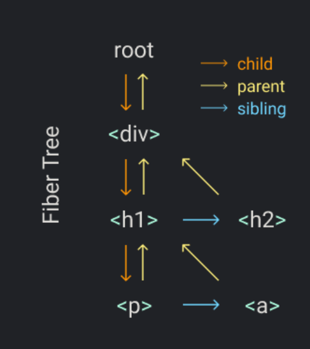
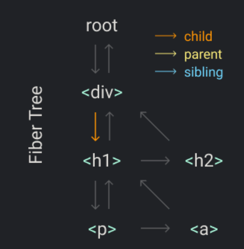

# 七步创建自己的React

本repo是翻译的英文版：https://pomb.us/build-your-own-react/

创建自己版本的react会分解成下面几个步骤：

- 第一步：createElement函数
- 第二步：render函数
- 第三步：并发(concurrent)模式
- 第四步：Fibers
- 第五步：render和commit阶段
- 第六步：Reconciliation
- 第七步：函数组件
- 第八步：hooks

# 第0步：回顾

先回顾下基础的概念，如果你已经知道React，JSX和DOM是如何工作的，可以跳过这步。

```javascript
const element = <h1 title="foo">Hello</h1>
const container = document.getElementById("root")
ReactDOM.render(element, container)
```

我们就用这三行代码来回顾。第一个定义了一个react元素，第二行从DOM中获取了一个节点，最后一行在container中渲染了react元素。现在就让我们用普通的js语法来逐步替换react语法。

第一行是用JSX定义的，从JSX转换到JS通常可以用一些类似Babel的编译工具。转换的过程很简单：调用createElement替换标签里的内容，并且传递tag名、props和children作为参数。

React.createElement从参数中创建一个对象，除了一些验证，这就是它做的所有事。所以，我们可以用输出结果来替代这个函数的调用。

```javascript
// const element = <h1 title="foo">Hello</h1> 替换为
const element = {
  type: "h1",
  props: {
    title: "foo",
    children: "Hello",
  },
}
```

这个element有两个属性，type和props，实际上有更多，但我们现在只关注这两个。type的类型是string，它表示我们要创建的DOM节点的类型，也就是你传递给document.createElement的tagName。props也是一个对象，它有JSX属性中所有的键值对，它还有一个特殊的属性：children。在这个例子中，children是一个string，但通常chilren是一个带着更多element的数组，这也是为什么elements可以组成树。

我们还需要替换ReactDOM.render。首先用element.type创建节点，然后将props传递给节点，这个例子里只有title。然后再为children创建节点，本例中只有文本，所以创建一个text节点。最后把text节点和h1都加到html里。

```javascript
// 下面替代 ReactDOM.render(element, container);
const node = document.creatElement(element.type);
node['title'] = node.props.title;

const text = document.createTextNode('');
text['nodeValue'] = element.props.children;

node.appendChild(text);
container.appendChild(node);
```

现在我们没有用React实现了之前那三行React代码。

# 第一步：createElement函数

让我们从一个新的app开始

```javascript
const element = (
  <div id="foo">
    <a>bar</a>
    <b />
  </div>
);
const container = document.getElementById("root");
ReactDOM.render(element, container);
```

正如之前步骤里说的，元素是一个带有type和props的对象，而createElement唯一要做的就是创建出这个对象。

```javascript
const element = React.createElement(
   "div",
   {id: "foo"},
    React.createElement("a", null, "bar"),
    React.createElement("b")
)
```

我们对props使用展开符，对children用剩余参数语法，这样的话，参数children永远是一个数组。

```javascript
function createElement(type, props, ...children) {
    return {
        type,
        props: {
            ...props,
            children
        },
    };
}
```

例如，`createElement("div")` 返回

```javascript
{
  "type": "div",
  "props": { "children": [] }
}
```

`createElement("div", null, a)` 返回:

```javascript
{
  "type": "div",
  "props": { "children": [a] }
}
```

`createElement("div", null, a, b)` 返回:

```javascript
{
  "type": "div",
  "props": { "children": [a, b] }
}
```

但是有一点还没考虑到，children也可能包含像string，number这些类型的原始数值。所以可以为它们创建一个特殊类型：TEXT_ELEMENT。

```javascript
function createElement(type, props, ...children) {
    return {
        type,
        props: {
            ...props,
            children: children.map(child => 
            	typeof child === 'object'
                ? child
                : createTextElement(child)
            ),
        },
    };
}
function createTextElement(text) {
    return {
        type: 'TEXT_ELEMENT',
        props: {
            nodeValue: text,
            children: [],
        }
    }
}
```

当没有children时，React不会像我们一样包裹原始值或者创建一个空数组。但我们这样做可以简化代码，并且我们更倾向于简洁的代码而不是高性能代码。

为了替换React，我们给自己的库命名为Didact，那么之前的代码就会被替换为

```javascript
const element = Didact.createElement(
   "div",
   {id: "foo"},
    Didact.createElement("a", null, "bar"),
    Didact.createElement("b")
)
```

但如何告诉babel用Didact的createElement而不是React的呢？

可以添加下面的注释，当babel转译时，将会用我们的createElement。

```javascript
/** @jsx Didact.createElement */
const element = (
  <div id="foo">
    <a>bar</a>
    <b />
  </div>
);
```


# 第二步：render函数

接下来，我们要写一个自己版本的ReactDOM.render函数。

目前，我们只关心往DOM里添加内容，待会儿再处理更新和删除。首先用元素的type创建DOM节点，然后把新节点添加到container中。

```javascript
export function render(element, container) {
  const dom = document.createElement(element.type);
  container.appendChild(dom);
}
```

接着递归地为每一个child做同样的操作

```javascript
export function render(element, container) {
  const dom = document.createElement(element, type);
  element.props.children.forEach(child => render(child, dom));
  container.appendChild(dom);
}
```

还需要额外处理文本节点，如果类型是TEXT_ELEMENT，那么就创建文本节点

```javascript
export function render(element, container) {
  const dom = element.type === 'TEXT_ELEMENT'
    ? document.createTextNode('')
    : document.createElement(element.type);
  element.props.children.forEach(child => render(child, dom));
  container.appendChild(dom);
}
```

最后，把props传递给节点

```javascript
export function render(element, container) {
  const dom = element.type === 'TEXT_ELEMENT'
    ? document.createTextNode('')
    : document.createElement(element.type);
    
  const isProperty = key => key !== 'children';
  Object.keys(element.props)
    .filter(isProperty)
    .forEach(name => {
      dom[name] = element.props[name]
    });
    
  element.props.children.forEach(child => render(child, dom));
  container.appendChild(dom);
}
```

好啦，我们现在可以把JSX渲染到DOM上了，git clone git@github.com:KimKeepLearning/build-own-react.git，切到jsx2dom分支，安装依赖，然后npm start可以看到效果。


# 第三步：并发模式

开始之前.....需要一点改动。render函数里的递归有一点问题，因为它一旦开始便不能停止，如果有很多元素，那会占很长时间的主线程。并且如果浏览器需要响应用户输入，也必须等render完成才能响应。

所以，我们会把渲染分成很多个小单位，并且每结束一个单位，判断浏览器是否有其它事要做，有的话则中断渲染。

```javascript
let nextUnitOfWork = null;

function workLoop(deadline) {
  let shouldYeild = false;
  while (nextUnitOfWork && !shouldYeild) {
    nextUnitOfWork = performUnitOfWork(nextUnitOfWork);
    shouldYeild = deadline.timeRemaining() < 1;
  }
  requestIdleCallback(workLoop);
}
requestIdleCallback(workLoop);
function performUnitOfWork(nextUnitOfWork) {
  // TODO
}
```

我们用了requestIdleCallback做循环，你可以把它看成是setTimeout，唯一的区别在于，浏览器会在空闲时执行回调而不是一个固定时间后执行回调。

React现在已经不再用requestIdleCallback了，现在它用的是scheduler子包，但对于这个用例来说，概念上是一样的。

requestIdleCallback也给我们一个deadline参数，可以用来检查离“浏览器掌握主导权”还剩多少时间。

performUnitOfWork用来执行一个单元的任务，并返回下一个单元。


# 第四步：Fibers

为了把所有的工作单元组织起来，我们需要一个数据结构：fiber树。我们会为每一个元素建立一个fiber节点，并且每个fiber节点是一个工作单元。

举个例子，假设要渲染这样一棵元素树：

```react
Didact.render(
  <div>
    <h1>
      <p />
      <a />
    </h1>
    <h2 />
  </div>
)
```

我们会首先创建一个root filber节点，并且把它设置成nextUnitOfWork，剩下的都在performUnitOfWork里处理，每个fiber节点都会经历三个操作：

1. 将element添加到DOM里
2. 为element.children创建fiber
3. 选择下一个unit

用fiber数据结构的好处之一就是，方便找到下一个工作单元。这也是为什么每个fiber节点都会连接到他的第一个child、下一个兄弟节点和父节点。



当一个fiber节点处理完，如果它有子节点，那它就会成为nextUnitOfWork。在本例中，处理完div后，下一个要处理的就是h1。




如果该节点没有子节点，则下一个要处理的是兄弟节点。本例中，p处理完后会处理a节点。

如果该节点既没有子节点也没有兄弟节点，那下一个要处理的是“叔叔”节点，也就是父节点的兄弟节点。就像本例中的a和h2。

另外，如果父节点没有兄弟节点，则一直往父节点查，直到找到一个带兄弟节点的父节点，或者到达root。如果到达root，则说明render里所有的工作单元都做完了。

好了，现在用代码实现上面的过程。

先把之前render里创建dom的部分提取出来：

```javascript
function createDOM(fiber) {
  const dom = fiber.type === 'TEXT_ELEMENT'
    ? document.createTextNode('')
    : document.createElement(fiber.type);
  
  const isProperty = key => key !== 'children';
  Object.keys(fiber.props)
    .filter(isProperty)
    .forEach(name => {
      dom[name] = fiber.props[name]
    });
  return dom;
}
```

在render里，把nextUnitOfWork初始化成root

```javascript
function render(element, container) {
  nextUnitOfWork = {
    dom: container,
    props: {
      children: [element]
    }
  };
}

```

然后，当浏览器空闲时，它会调用workLoop，那对root的处理也开始了。

```javascript
function workLoop(deadline) {
  let shouldYeild = false;
  while (nextUnitOfWork && !shouldYeild) {
    nextUnitOfWork = performUnitOfWork(nextUnitOfWork);
    shouldYeild = deadline.timeRemaining() < 1;
  }
  requestIdleCallback(workLoop);
}
```

在performUnitOfWork里，首先将element添加到DOM里

```javascript
function performUnitOfWork(fiber) {
  if (!fiber.dom) {
    fiber.dom = createDom(fiber);
  }
  if (fiber.parent) {
    fiber.parent.dom.appendChild(fiber.dom);
  }
}
```

然后为children创建fiber

```javascript
function performUnitOfWork(fiber) {
  ...
  const elements = fiber.props.children;
  let index = 0;
  let prevSibling = null;
  while (index < elements.length) {
    const element = elements[index];

    const newFiber = {
      type: element.type,
      props: element.props,
      parent: fiber,
      dom: null,
    };
    
  }
}
```

再把创建出来的fiber节点加到fiber树里

```javascript
function performUnitOfWork(fiber) {
  ...
  while (index < elements.length) {
    ...
    if (index === 0) {
      fiber.child = newFiber
    } else {
      prevSibling.sibling = newFiber;
    }
    prevSibling = newFiber;
    index++;
  }
}
```

最后，查找下一个工作单位并返回：

```javascript
function performUnitOfWork(fiber) {
  ...
  while (index < elements.length) {
    ...
    ...
    if (fiber.child) {
      return fiber.child;
    }
    let nextFiber = fiber;
    while (nextFiber) {
      if (nextFiber.sibling) {
        return nextFiber.sibling;
      }
      nextFiber = nextFiber.parent;
    }
  }
}
```

完整的performUnitOfWork：

```javascript
function performUnitOfWork(fiber) {
  // 1. 将element添加到DOM里
  if (!fiber.dom) {
    fiber.dom = createDom(fiber);
  }
  if (fiber.parent) {
    fiber.parent.dom.appendChild(fiber.dom);
  }
  // 2. 为element.children创建fiber
  const elements = fiber.props.children;
  let index = 0;
  let prevSibling = null;
  while (index < elements.length) {
    const element = elements[index];
    const newFiber = {
      type: element.type,
      props: element.props,
      parent: fiber,
      dom: null,
    };
    if (index === 0) {
      fiber.child = newFiber
    } else {
      prevSibling.sibling = newFiber;
    }
    prevSibling = newFiber;
    index++;
  }
  // 3. 选择下一个unit
  if (fiber.child) {
    return fiber.child;
  }
  let nextFiber = fiber;
  while (nextFiber) {
    if (nextFiber.sibling) {
      return nextFiber.sibling;
    }
    nextFiber = nextFiber.parent;
  }
}
```

# 第五步：render和commit阶段

现在有一个新问题。在performUnitOfWork里，我们每次都会往dom中添加元素，然而，浏览器是可以在整棵树渲染完成前中断我们的工作的，所以，用户可能会看到一个不完整的UI，这肯定是不符合预期的。

因此，我们删除改变DOM的那部分，并且跟踪fiber树的root，我们称它为正在进行中的root，即wipRoot。

```javascript
function render(element, container) {
  wipRoot = {
    dom: container,
    props: {
      children: [element]
    }
  };
  nextUnitOfWork = wipRoot;
}

let nextUnitOfWork = null;
let wipRoot = null;
```

一旦所有工作完成，把整颗fiber树提交并生成DOM

```javascript
function workLoop(deadline) {
  let shouldYeild = false;
  while (nextUnitOfWork && !shouldYeild) {
    nextUnitOfWork = performUnitOfWork(nextUnitOfWork);
    shouldYeild = deadline.timeRemaining() < 1;
  }
  if (!nextUnitOfWork && wipRoot) {
    commitRoot(); // 在commitRoot中，对整个fiber处理，添加到DOM中
  }
  requestIdleCallback(workLoop);
}

function performUnitOfWork(fiber) {
  if (!fiber.dom) {
    fiber.dom = createDom(fiber);
  }
  // 这里删除了添加到DOM中的处理
  const elements = fiber.props.children;
}

```

在commitRoot里递归的处理所有节点

```javascript
function commitWork(fiber) { // 先序遍历
  if (!fiber) {
    return;
  }
  const domParent = fiber.parent.dom;
  domParent.appendChild(fiber.dom);
  commitWork(fiber.child);
  commitWork(fiber.sibling);
}
function commitRoot() {
  commitWork(wipRoot.child);
  wipRoot = null;
}
```


# 第六步：Reconciliation

现在，我们的react可以处理往DOM中添加元素了，但是更新和删除节点呢？这就是这步要做的，我们需要把从render里接受到的和刚commit的节点做比较。因此，我们保存“最后commit”的fiber树的引用，称它为currentRoot。

```javascript
function commitRoot() {
  commitWork(wipRoot.child);
  currentRoot = wipRoot;
  wipRoot = null;
}
let currentRoot = null;
function render(element, container) {
  wipRoot = {
    dom: container,
    props: {
      children: [element]
    },
    alternate: currentRoot,
  };
  nextUnitOfWork = wipRoot;
}

```

我们还增加了一个alternate属性，用来指向旧fiber树。

先把创建fiber的代码从performUnitOfWork里提取出来：

```javascript
function reconcileChildren(wipFiber, elements) {
  let index = 0;
  let prevSibling = null;

  while (index < elements.length) {
    const element = elements[index];

    const newFiber = {
      type: element.type,
      props: element.props,
      parent: fiber,
      dom: null,
    };
    if (index === 0) {
      wipFiber.child = newFiber
    } else {
      prevSibling.sibling = newFiber;
    }
    prevSibling = newFiber;
    index++;
  }
}

function performUnitOfWork(fiber) {
  if (!fiber.dom) {
    fiber.dom = createDOM(fiber);
  }
  const elements = fiber.props.children;
  reconcileChildren(fiber, elements);
  if (fiber.child) {
    return fiber.child;
  }
  let nextFiber = fiber;
  while (nextFiber) {
    if (nextFiber.sibling) {
      return nextFiber.sibling;
    }
    nextFiber = nextFiber.parent;
  }
}

```

下面对reconcileChildren做些改造，让它具有比较新旧的能力。我们用fiber.type来比较：

- 如果旧fiber和新element有一样的type，我们可以保留dom，只更新它的props
- 如果type不一样，并且存在新的element，需要创建一个新的dom
- 如果type不一样，并且是一个旧的element，需要删除旧的

```javascript
function reconcileChildren(wipFiber, elements) {
  // oldFiber是刚渲染的, elements是要渲染的
  let index = 0;
  let oldFiber = wipFiber.alternate && wipFiber.alternate.child;
  let prevSibling = null;
  // 同时遍历新旧节点
  while (index < elements.length || oldFiber != null) { 
    const element = elements[index];
    const newFiber = null;

    const sameType = oldFiber && element && element.type === oldFiber.type;
    if (sameType) {
      // update
    }
    if (element && !sameType) {
      // create
    }
    if (oldFiber && !sameType) {
      // delete
    }

    if (oldFiber) {
      oldFiber = oldFiber.sibling;
    }
	...
  }  
  
}

```

更新时，除了props，基本都可以复用oldFiber的属性，我们再加一个effectTag，后面会用到

```javascript
if (sameType) {
  // update
  newFiber = {
    type: oldFiber.type,
    props: element.props,
    dom: oldFiber.dom,
    parent: wipFiber,
    alternate: oldFiber,
    effectTag: "UPDATE",
  }
}

```

创建新的fiber，我们用PLACEMENT Tag：

```javascript
if (element && !sameType) {
  // create
  newFiber = {
    type: element.type,
    props: element.props,
    dom: null,
    parent: wipFiber,
    alternate: null,
    effectTag: "PLACEMENT"
  }
}
```

删除用“DELETION”标签，由于新的fiber树并没有要删除的oldFiber，所以需要记录下，然后在commit阶段处理

```javascript
function render(element, container) {
    ...
    deletions = [];
}

let deletions = null;
...
if (oldFiber && !sameType) {
  // delete
  oldFiber.effectTag = "DELETION";
  deletions.push(oldFiber);
}
function commitRoot() {
  deletions.forEach(commitWork)
  ...
}
```

接下来就是改造commitWork，使它能处理我们新增的effectTag

```javascript
function commitWork(fiber) {
  if (!fiber) {
    return;
  }
  const domParent = fiber.parent.dom;
  if (
    fiber.effectTag === "PLACEMENT" &&
    fiber.dom !== null) {
    domParent.appendChild(fiber.dom);
  } else if (
    fiber.effectTag === "UPDATE" &&
    fiber.dom !== null
  ) {
    updateDom(fiber.dom, fiber.alternate.props, fiber.props)
  } else {
    domParent.removeChild(fiber.dom);
  }
  commitWork(fiber.child);
  commitWork(fiber.sibling);
}
function updateDom(dom, prevProps, nextProps) {
  // TODO
}

```

在updateDom里，我们比较新旧props并更新，注意，事件相关的prop要特殊处理

```javascript
const isEvent = key => key.startsWith("on")
const isProperty = key => key !== "children" && !isEvent(key)
const isNew = (prev, next) => key => prev[key] !== next[key];
const isGone = (prev, next) => key => !(key in next);

function updateDom(dom, prevProps, nextProps) {
  // remove old or changed event listeners
  Object.keys(prevProps)
    .filter(isEvent)
    .filter(key => !(key in nextProps) || isNew(prevProps, nextProps)(key))
    .forEach(name => {
      const eventType = name
        .toLowerCase()
        .substring(2)
      dom.removeEventListener(
        eventType,
        prevProps[name]
      )
    })
  // Remove old prop
  Object.keys(prevProps)
    .filter(isProperty)
    .filter(isGone(prevProps, nextProps))
    .forEach(name => {
      dom[name] = ""
    });
  // set new or changed prop
  Object.keys(nextProps)
    .filter(isProperty)
    .filter(isNew(prevProps, nextProps))
    .forEach(name => {
      dom[name] = nextProps[name]
    });
  // add new event handler
  Object.keys(nextProps)
    .filter(isEvent)
    .filter(isNew(prevProps, nextProps))
    .forEach(name => {
      const eventType = name
          .toLowerCase()
          .substring(2)
        dom.addEventListener(
          eventType,
          nextProps[name]
        )
    })
}
```

可以在[这里](https://codesandbox.io/s/didact-6-96533)试试！

# 第七步：函数组件

这一步要支持函数式组件。首先把组件改写成函数式：

```javascript
import { Didact } from "./didact";

/** @jsx Didact.createElement */
function App(props) {
  return <h1>Hi, {props.name}</h1>
}
const element = <App name="foo" />
const container = document.getElementById("root");
Didact.render(element, container);
```

把上面这段翻译下，应该是：

```javascript
function App(props) {
    return Didact.createElement(
    	"h1",
        null,
        "Hi ",
        props.name
    )
}
const element = Didact.createElement(App, { name: "foo" });
```

函数组件不同之处在于：

- 函数组件的fiber没有dom节点
- children不是从props里取，而是通过运行函数获得

对performUnitOfWork改造，判断区分函数组件:

```javascript
function performUnitOfWork(fiber) {
  const isFunctionComponent = fiber.type instanceof Function;
  if (isFunctionComponent) {
    updateFunctionComponent(fiber);
  } else {
    updateHostComponent(fiber);
  }

  if (fiber.child) {
    return fiber.child
  }
  let nextFiber = fiber
  while (nextFiber) {
    if (nextFiber.sibling) {
      return nextFiber.sibling
    }
    nextFiber = nextFiber.parent
  }
}

function updateFunctionComponent(fiber) {
  // TODO
}
function updateHostComponent(fiber) {
  if (!fiber.dom) {
    fiber.dom = createDOM(fiber)
  }
  const elements = fiber.props.children
  reconcileChildren(fiber, elements)
}
```

updateHostComponent和之前一样，在updateFunctionComponent运行函数来得到children：

```javascript
function updateFunctionComponent(fiber) {
  const children = [fiber.type(fiber.props)];
  reconcileChildren(fiber, children);
}
```

这样区分函数fiber处理后，不是所有的fiber都有dom属性了，所以要改变两个地方。

首先，在commitWork里查找父节点时，要往上查，直到找到一个具有dom的fiber：

```javascript
function commitWork(fiber) {
    ...
    let domParentFiber = fiber.parent;
    while (!domParentFiber.dom) {
      domParentFiber = domParentFiber.parent;
    }
    const domParent = domParentFiber.dom;
    ...
}
```

其次，在删除节点时，也需要查找直到找到带dom属性的fiber节点

```javascript
function commitWork(fiber) {
    ...
    else if (fiber.effectTag === "DELETION") {
      commitDeletion(fiber, domParent);
  	}
    ...
}
function commitDeletion(fiber, domParent) {
  if (fiber.dom) {
    domParent.removeChild(fiber.dom)
  } else {
    commitDeletion(fiber.child, domParent);
  }
}
```


# 第八步：hooks

既然有了函数组件，那就把state也加上吧。

把组件换成一个经典的计数器组件，每点击一次，计数+1。

```javascript
function Counter() {
  const [state, setState] = Didact.useState(1);
  return (
    <h1 onClick={() => setState(c => c + 1)}>
      Count: { state }
    </h1>
  )
}
const element = <Counter />
const container = document.getElementById("root");
Didact.render(element, container);
```

实现useState前，需要初始化一些全局变量，以便在useState函数里使用

```javascript
let wipFiber = null;
let hookIndex = null;

function updateFunctionComponent(fiber) {
  wipFiber = fiber;
  hookIndex = 0;
  wipFiber.hooks = [];
  const children = [fiber.type(fiber.props)];
  reconcileChildren(fiber, children);
}

function useState(inital) {

}
```

添加的hooks数组可以支持在同一个组件中多次调用useState，并且用hookIndex来记录当前的hook。

当函数组件调用useState，首先检查是否有旧的hook，如果有，从旧的里把state拿出来，否则用初始值。然后将新hook添加到fiber上

```javascript
function useState(inital) {
  const oldHook = 
        wipFiber.alternate && 
        wipFiber.alternate.hooks && 
        wipFiber.alternate.hooks[hookIndex];
  const hook = {
    state: oldHook ? oldHook.state : inital
  }
  wipFiber.hooks.push(hook);
  hookIndex++;
  return [hook.state];
}
```

还差一个setState，setState接受一个行为，我们把这个行为添加到hook的队列中，然后触发重新渲染

```javascript
function useState(inital) {
  const oldHook = 
        wipFiber.alternate && 
        wipFiber.alternate.hooks && 
        wipFiber.alternate.hooks[hookIndex];
  const hook = {
    state: oldHook ? oldHook.state : inital,
    queue: [],
  }
  const actions = oldHook ? oldHook.queue : []
  actions.forEach(action => {
    hook.state = action(hook.state)
  })
  const setState = action => {
    hook.queue.push(action);
    wipRoot = {
      dom: currentRoot.dom,
      props: currentRoot.props,
      alternate: currentRoot,
    }
    nextUnitOfWork = wipRoot;
    deletions = []
  }
  wipFiber.hooks.push(hook);
  hookIndex++;
  return [hook.state, setState];
}
```

这就是全部了，可以在[这里](https://codesandbox.io/s/didact-8-21ost)试试


